# Online Marketplace - freeCodeCamp

The Puddle project is a simple marketplace where you can put products on sale, see the products that other people have pput there and contact the sellers. This project is taught by Stein Helset on the [Learn Django by Building an Online Marketplace – Python Tutorial for Beginners](https://youtu.be/ZxMB6Njs3ck) video on [freeCodeCamp](https://www.youtube.com/@freecodecamp) Youtube channel. You can find Stein at [@codewithstein](https://twitter.com/codewithstein) on twitter and on Youtube at [Code With Stein](https://www.youtube.com/@codewithstein).

## About the project

To Sign Up at Puddle, you need to choose an username, an email and a password to register.

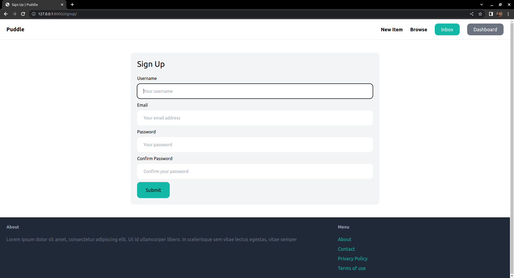

In case those informations are not valid, an error message will be shown at your screen saying what is going wrong.

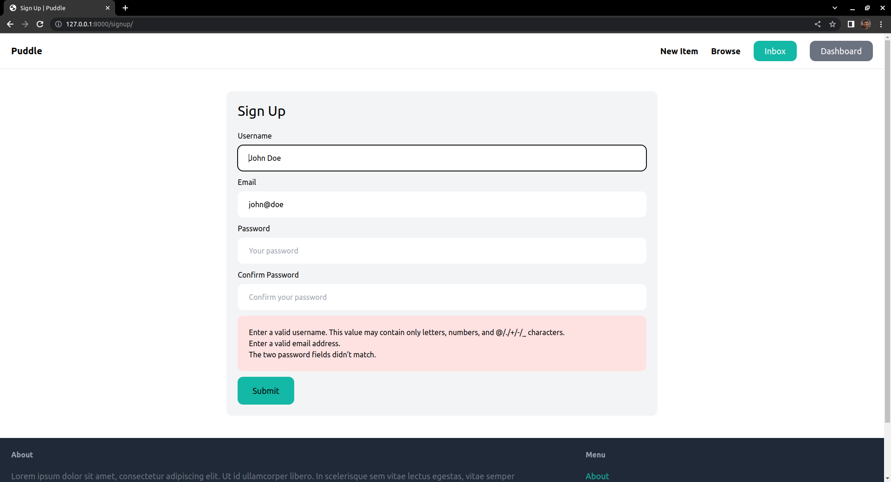

When you're registered, you'll be redirected to the login page.

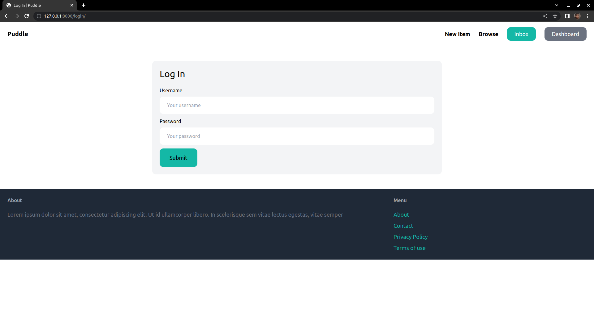

When you're logged in, you'll see the home page. On this page you'll see the newest registered products with their name, price and image. There is also a Categories section showing the quantity of registered products in each registered category.

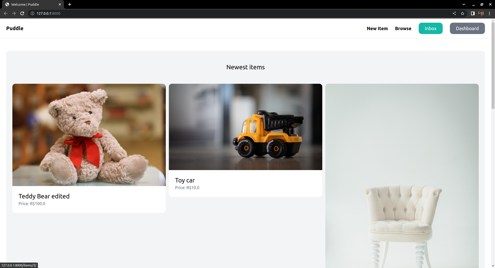
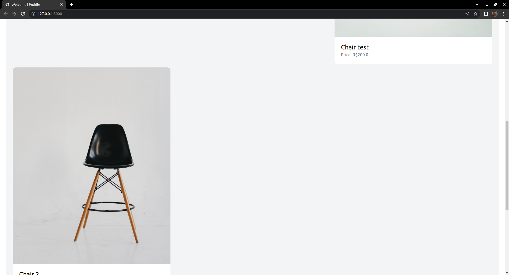
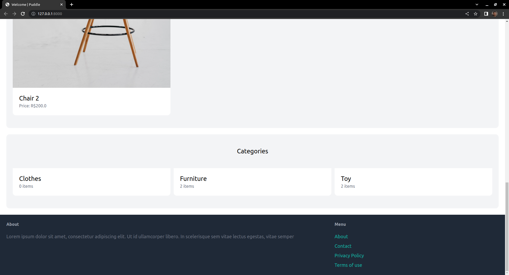

On the home page you can click in any product to see details of it and contact the seller

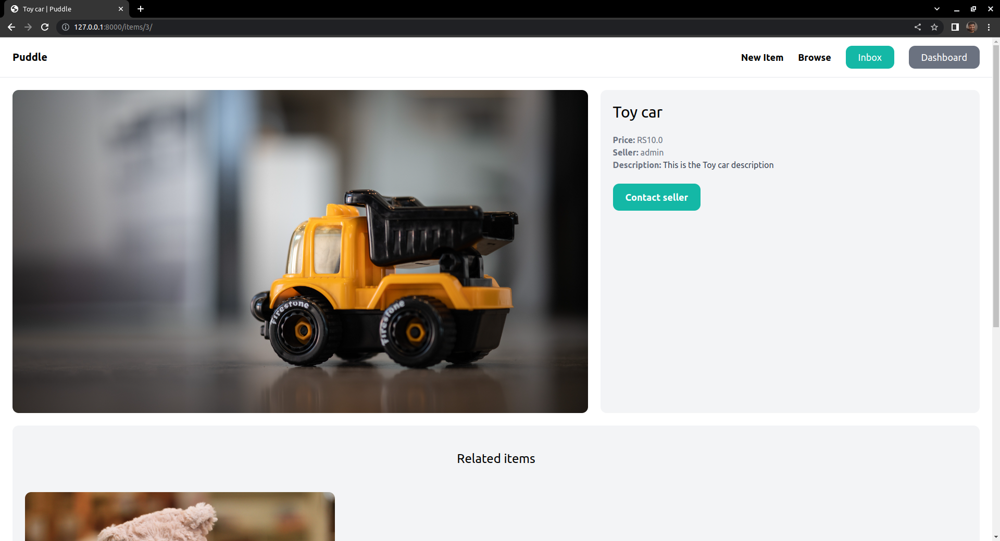

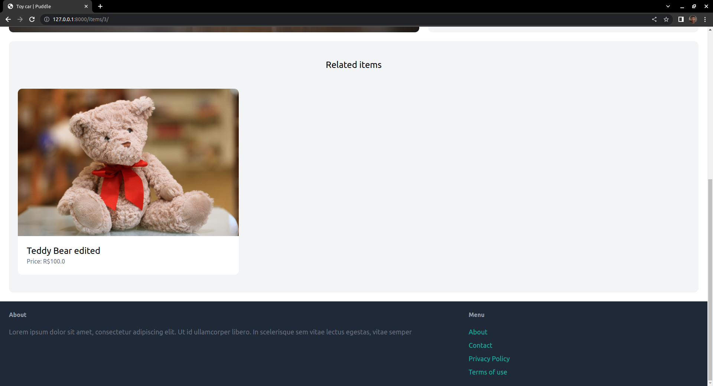

, or edit/delete an item that you registered before.

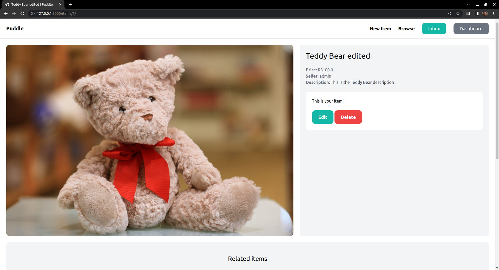

Back to the home page you can find a navbar that allows you to register a new item;

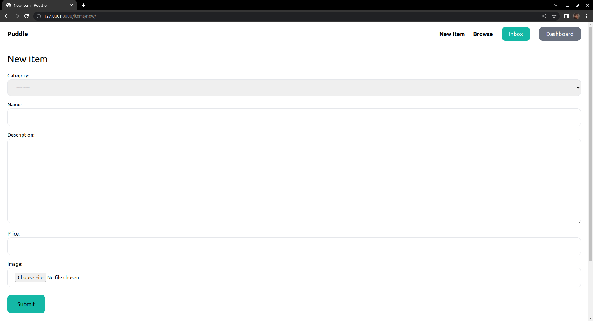

to browse for other products where you can filter by category or search for a word in the name, or the description, of the product;

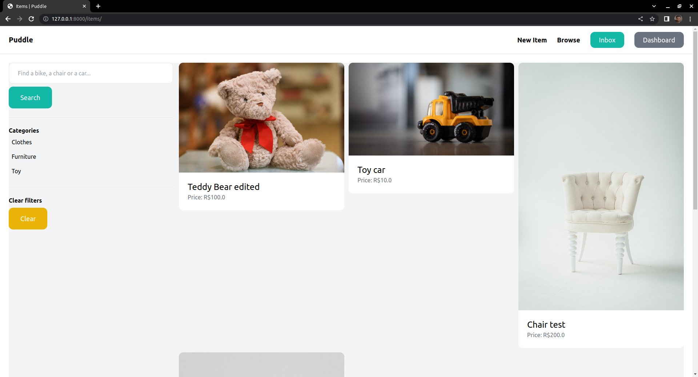

to check your inbox and see the conversations you had on specif products

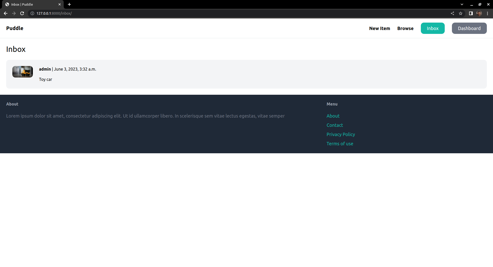

and the messages you sent and/or receveid to/from the seller of that product;

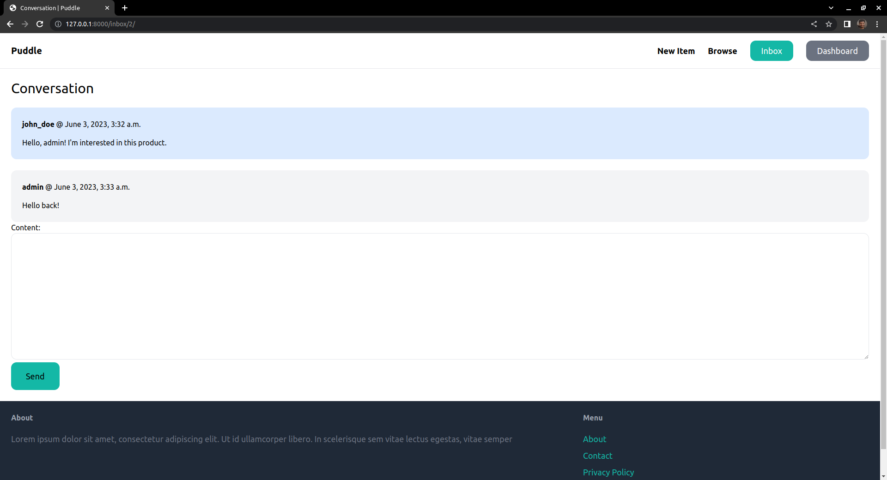

to see a dashboard showing the items you registered.

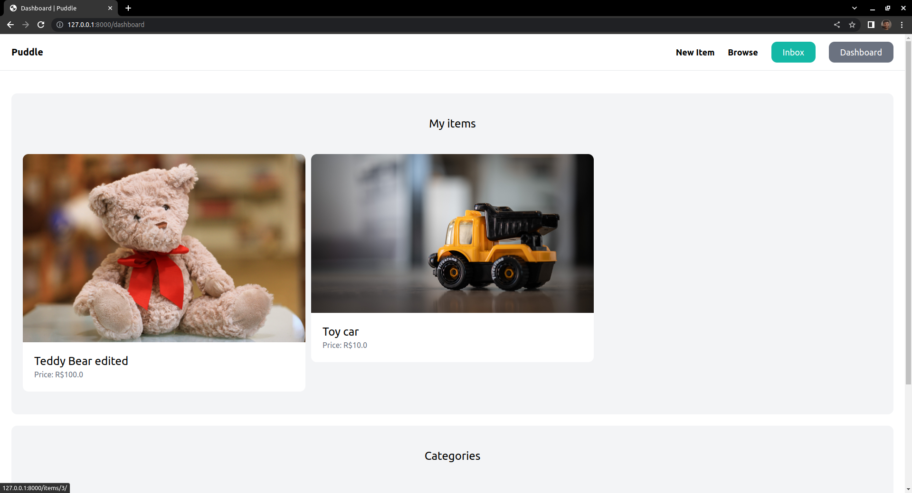

### Built with

- Django
- HTML
- TailwindCSS

